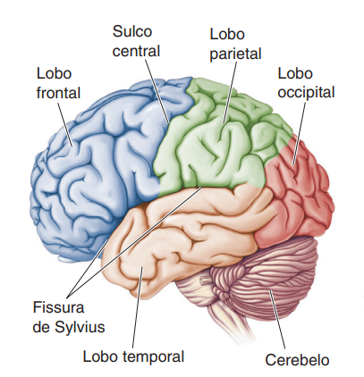
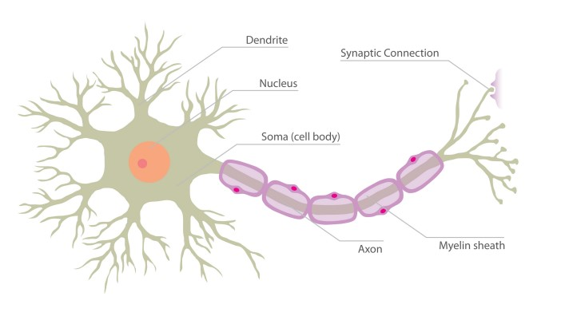

# What is EEG and How Does it Work?

Antes de explorarmos os detalhes do eletroencefalograma (EEG) e sua operação, é fundamental compreendermos a extraordinária complexidade e a centralidade do cérebro no funcionamento do corpo humano.

Ao longo da história da humanidade, o cérebro tem sido um enigma que desafia nossa compreensão plena. Desde os primórdios da civilização, reconhecemos sua importância vital para a vida e suas funções intrínsecas na regulação de diversos processos corporais e cognitivos. Até mesmo nossos ancestrais pré-históricos parecem ter valorizado a relevância do cérebro, como indicado por registros de procedimentos cirúrgicos cranianos datados de milhares de anos atrás [1].

Durante séculos, inúmeras especulações e teorias foram propostas sobre o funcionamento cerebral. Contudo, foram os avanços científicos dos séculos XVII e XVIII que nos permitiram uma análise mais detalhada da substância encefálica. Nesse período, os cientistas começaram a distinguir dois tipos principais de tecido cerebral: a substância cinzenta e a substância branca. A substância branca, conectada aos nervos do corpo, foi identificada como contendo as fibras responsáveis pela comunicação de informações com a substância cinzenta.

No final do século XVIII, como ressaltado por Bear, Connors e Paradiso em seu livro "Neurociências: desvendando o sistema nervoso" (2017), houve um reconhecimento generalizado de que o sistema nervoso possuía uma divisão fundamental: o sistema nervoso central, composto pelo cérebro e pela medula espinhal, e o sistema nervoso periférico, formado pela rede de nervos que se estendem pelo corpo. Um avanço significativo na neuroanatomia foi a observação de um padrão comum de elevações (giros) e depressões (sulcos e fissuras) na superfície cerebral, presente em todos os indivíduos. Esse padrão possibilitou a divisão do cérebro em diferentes lobos, suscitando a ideia de que diversas funções poderiam estar localizadas em áreas específicas do cérebro. Essas descobertas, como discutido pelos autores, marcaram o início da era da localização cerebral.

*Figura 01: Os lobos do cérebro.* Fonte: [1].

O entendimento da divisão do cérebro nos permiriu explorar a localização de funções específicas e como elas eram processadas (posteriormente o entendimento desta divisão fará total sentido para o caso de estudo na disciplina). Compreender como o encéfalo funciona é um grande desafio. Para reduzir a complexidade do problema, dado que o cérebro é um órgão complexo e abordar todos os temas relacionados a seu funcionamento demandaria livros, artigos, além de não ser o objetivo do texto (não sou profissional da área)...Aplicamos a técnica de *abordagem reducionista*, que consiste em fragmentar em pedaços menores um problema maior e realizar uma análise sistemática. Iremos explorar "apenas" o comportamento  da rede de células nervosas chamadas neurônios.

## Neurônios

O neurônio, também conhecido como célula nervosa, é composto por diversas partes: o corpo celular (ou soma), os dendritos e o axônio. Uma membrana chamada neuronal separa o conteúdo interno do neurônio do meio externo. O corpo celular contém o núcleo e a maioria das organelas, onde ocorrem processos vitais para a função celular. Os dendritos são ramificações que se estendem do corpo celular, responsáveis por receber sinais de outros neurônios ou de células sensoriais. O axônio é uma única extensão longa do neurônio, transmitindo os sinais elétricos gerados no corpo celular para outras células.

*Figura 03: Estrutura de um neurônio.* Fonte: [2].

A transmissão de sinais no neurônio ocorre por meio de potenciais de ação, que são mudanças rápidas no potencial elétrico ao longo da membrana neuronal. Quando um estímulo é recebido pelos dendritos e é forte o suficiente para atingir um limiar crítico, um potencial de ação é desencadeado no corpo celular e se propaga ao longo do axônio até seus terminais. Essa transmissão de sinais em cadeia é denominada de sinápses (Berne e Levy, 1998; Kandel et al., 2000). É um mecanisco fundamental para a transmissão de infromações no sistema nervoso.

Um exemplo prático do funcionamento de uma atividade sináptica ocorre quando tocamos uma superfície quente, os neurônios sensoriais na pele detectam o estímulo e geram potenciais de ação que se propagam ao longo de seus axônios até alcançar as terminações nervosas na medula espinhal. Nesse ponto, esses neurônios estabelecem sinapses excitatórias com os neurônios motores na medula espinhal.
Após o processamento da informação na medula espinhal, uma ação é desencadeada como resposta ao estímulo inicial. Os neurônios motores na medula espinhal, influenciados pela atividade sináptica dos neurônios sensoriais, geram potenciais de ação que se propagam ao longo de seus axônios até alcançar os músculos relevantes. Esses potenciais de ação ativam as fibras musculares, desencadeando a contração muscular como uma resposta ao estímulo inicial de tocar uma superfície quente. Essa ação é coordenada pelo sistema nervoso, permitindo uma reação rápida e adaptativa do organismo ao ambiente (removendo o contato com a superfície quente).

A atividade sináptica, gera um impulso elétrico denominado potencial pós-sináptico. Este potencial, que chamaremos de agora em diante de, biopotencia, pode ser detectado e registrado, através de técnicas invasivas (internamente ao crânio) e não invasivas (externas ao crânio). A atividade elétrica gerada por milhares de neurônios, se somam em escala, se espalham pelos tecidos, ossos e crânio. Essa atividade elétrica cerebral pode ser medida externamente na superfíce da cabeça através de um eletroencefalograma (**EEG**).

## EEG

## Referência:

- Bear, M. F., Connors, B. W., & Paradiso, M. A. (2017). Neurociências: desvendando o sistema nervoso. Artmed Editora.

- FOUNTAS, Zafeirios et al. Spiking neural networks for human-like avatar control in a simulated environment. Computing Science of Imperial College London, p. 1-60, 2011.

- CARDOSO, Adriano Silva Vale. Instrumentação e metodologias de mediçãode biopotenciais. 2010.

